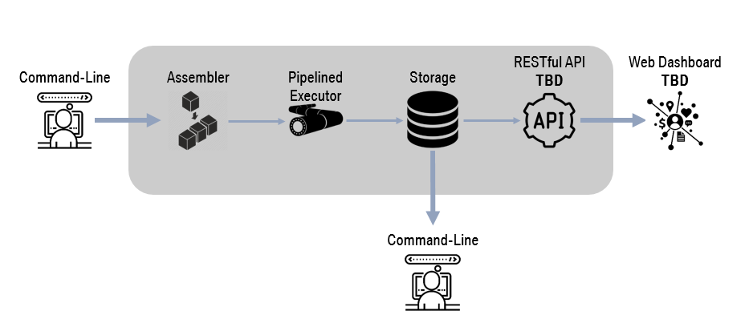

# Foundation of Computer Engineering

## Project 03 -- MIPS Simulator

---

### Overview

The architecture of MIPS simulator in this project is shown below. 



The simulator should be launched from terminal using the following command:
```shell
./main --input [INPUT_ASM] --mode [instruction|cycle] --number [NUM]
```

The above three options are both required to run the simulator:
* input: input MIPS asm filename
* mode: execution mode either **instruction** for instruction by instruction or **cycle** for cycle by cycle
* number: execution time by *instruction(instruction mode)* or *clock cycle(cycle mode)*

The simulator consists of **two main components**: *the assembler* and *the pipelined executor*. 

First, **the assembler** will take the input ASM and assemble it into MIPS machine codes. It will generate the instruction image in both **text segment** and **plain text** formats for execution and human inspection, respectively.

After that, **the pipelined executor** will take the generated text segment plus data memory and execute the program using the simulated pipelined MIPS processor.

When the execution finishes, the following outputs will be generated:
* System State Plot
register contents, pipeline state by clock cycle
* Register Contents Report
register contents after execution
* Resource Utilization Report
resource utilization analysis after execution

Currently the above contents are dumped as files inside workding directory. Later a RESTful service will be developed to make them accessible from web dashboard. Stay tuned.

---

### Assembler

The assembler loads the input ASM, convert each statement into MIPS machine code then pack all machine codes into text segment for executor use. The above workflow is summarized in the following code snippet. [Full Source Code](assembler.cpp):

```c++
Assembler(const string &input_filename, std::uint32_t text_seg_addr): 
TEXT_SEG_ADDR(text_seg_addr) {
    // load instructions:
    load(input_filename);

    // parse instructions into machine code:
    parse();

    // build instruction memory image:
    build();
}
```

The loader will first normalize statements inside ASM before processing. First, all leading and tailing whitespaces will be removed. After that, each character will be converted into lower case. 

Then the parser will digest each statement using pre-defined regex patterns. Machine code will be assembled based on extracted fields from parser.

Finally, the generated machine codes will be packed into [TextSegment](isa.h) structure for later executor use.

---

### Executor

The executor executes the generated instruction image using simulated pipelined processor. When new image is given, it will first initialize its state then start to link to and execute the image. The overall workflow is shown as follows:

```c++
void Executor::run(const std::string &MODE, const int N) {
    // initialize pipeline:
    init();

    // initialize PC:
    PC = text_segment.get_address_first();
    const ISA::Address TEXT_SEGMENT_END = text_segment.get_address_last();

    // execute:
    while (DPC != TEXT_SEGMENT_END) {
        // termination check:
        if (is_terminated(MODE, N)) {
            return;
        }

        // dump pipeline state each cycle for better illustration:
        dump_pipeline_state();

        // execute pipeline:
        execute_pipeline();

        // update clock cycle count:
        monitor.total_clock_cycles += 1;
    }
}
```

#### Pipeline Implementation

Below is the pipeline implementation. The highlights of this implementation are as follows:

* Run Component Stages in Reverse Order
This helps to eliminate the intermediate buffer
* Define Extra Output Stage for WB
Here a new state variable, *DPC*, is defined to identify the just-finished instruction out of pipeline.

```c++
void Executor::execute_pipeline(void) {
    /*
        Write Back
            Input: MEM/WB
            Output: DPC for just finished instruction
     */
    execute_WB();
    /*
        Memory Access
            Input: EX/MEM
            Output: MEM/WB
     */
    execute_MEM();
    /*
        Execution
            Input: ID/EX
            Output: EX/MEM
     */
    execute_EX();
    /*
        Instruction Decoding
            Input: IF/ID
            Output: ID/EX
     */
    execute_ID();
    /*
        Write Back
            Input: PC
            Output: IF/ID
     */
    execute_IF();
}
```

#### Hazard Detection and Resolution

In this simulator both **control hazard** and **data hazard** can be detected and resolved. Hazard resolution is implemented using stall, i.e., to insert nop into the pipeline. Both control and data hazards are detected in ID stage. Control hazard is resolved in IF stage and data hazard is resolved in WB stage, respectively.

##### Data Hazard

###### Detection

Data hazard detection happens inside ID stage. In ID stage, when tries to read register that will be modified later in WB stage, data hazard should be flagged and nop should be inserted for to-be-finished WB operation.

```c++
void Executor::execute_ID() {
    /*
     * before highlight
     */

    ISA::Word a_reg_addr = ISA::get_instruction_field(IF_ID.IR, ISA::Field::RS);
    ISA::Word b_reg_addr = ISA::get_instruction_field(IF_ID.IR, ISA::Field::RT);

    // data hazard detected:
    if (
        (EX_MEM.WriteRegAddr != 0x0 && EX_MEM.WriteRegAddr == a_reg_addr) ||
        (MEM_WB.WriteRegAddr != 0x0 && MEM_WB.WriteRegAddr == a_reg_addr) ||
        (EX_MEM.WriteRegAddr != 0x0 && EX_MEM.WriteRegAddr == b_reg_addr) ||
        (MEM_WB.WriteRegAddr != 0x0 && MEM_WB.WriteRegAddr == b_reg_addr)     
    ) {
        hazard.data = true;
    }

    // insert nop:
    if (hazard.data) {
        ID_EX.reset();
        monitor.nop_count[Stage::ID] += 1;
        return;
    }

    /*
     * after highlight
     */
}
```

###### Resolution

Data hazard resolution happens inside WB stage. When WB operation happens when data hazard is flagged, the indicator should be reset.

```c++
void Executor::execute_reg_write(std::int32_t reg_addr, std::int32_t value) {
    if (0x0 != reg_addr) {
        // write back:
        reg[reg_addr] = value;

        // resolve data hazard:
        if (hazard.data) {
            hazard.data = false;
        }
    }
}
```

##### Control Hazard

###### Detection

Control hazard detection happens inside ID stage. In ID stage, when current instruction is BEQ, the pipeline should be stalled and nop should be inserted before target PC is resolved.

```c++
void Executor::execute_ID() {
    /*
     * before highlight
     */

    ISA::Word opcode = ISA::get_instruction_field(IF_ID.IR, ISA::Field::OPCODE);
    
    // control hazard detected:
    if (ISA::OpCode::BEQ == opcode) {
        hazard.control = true;
    }

    /*
     * after highlight
     */
}
```

###### Resolution

Control hazard resolution happens inside IF stage. When control hazard is flagged and target PC is resolved by the output of BEQ instruction, the indicator should be reset.

```c++
void Executor::execute_IF() {
    /*
     * before highlight
     */
    if (hazard.control) {
        if (ISA::OpCode::BEQ == ISA::get_instruction_field(EX_MEM.IR, ISA::Field::OPCODE)) {
            // control hazard resolved:
            if (EX_MEM.Cond) {
                PC = EX_MEM.ALUOutput;
            }

            hazard.control = false;
        } else {
            // insert nop:
            IF_ID.reset();
            monitor.nop_count[Stage::IF] += 1;
            return;
        } 
    }

    /*
     * after highlight
     */
}
```
---

### Resource Utilization

Statistics used for resource utilization analysis are collected during the whole running process

#### Total Clock Cycles

Total clock cycles is collected after each pipeline execution:

```c++
void Executor::run(const std::string &MODE, const int N) {
    /*
     * before highlight
     */

    // execute:
    while (DPC != TEXT_SEGMENT_END) {
        // termination check:
        if (is_terminated(MODE, N)) {
            return;
        }

        // dump pipeline state each cycle for better illustration:
        dump_pipeline_state();

        // execute pipeline:
        execute_pipeline();

        // update clock cycle count:
        monitor.total_clock_cycles += 1;
    }

    /*
     * after highlight
     */
}
```

#### Total Instructions

Total instructions is collected inside IF stage:

```c++
void Executor::execute_IF() {
    /*
     * before highlight
     */

    // update instruction count:
    ISA::MachineCode instruction = text_segment.get_binary(PC);
    PC = PC + 4;
    monitor.total_instructions += 1;

    /*
     * after highlight
     */
}
```

#### Utilization for Stages

Utilization analysis for component stage works as follows: When a stage gets an nop instruction, its *nop_count* increment by 1. Below is the code snippet for WB:

```c++
void Executor::execute_WB() {
    /*
     * before highlight
     */

    if (MEM_WB.nop) {
        monitor.nop_count[Stage::WB] += 1;
        return;
    }

    /*
     * after highlight
     */
}
```

---

### Testcase

#### Data Hazard Detection

In this demo the following ASM snippet is used to demonstrate how to handle data hazard.

```asm
LUI $t8 0x3

LUI $t9 0x5

MUL $t0 $t8 $t9
```
Run the following command in terminal to run this testcase:

```shell
./main --input ../input/test-mul.asm --mode instruction --number 10
```

##### Instruction Memory Image
```shell
0x00400000: 0x3c180003;	lui $t8 0x3
0x00400004: 0x3c190005;	lui $t9 0x5
0x00400008: 0x03194026;	mul $t0 $t8 $t9
```

##### System State Plot

```shell
[Clock Cycle]: 0
        IF: lui $t8 0x3
        ID: nop
        EX: nop
        MEM: nop
        WB: nop

[Clock Cycle]: 1
        IF: lui $t9 0x5
        ID: lui $t8 0x3
        EX: nop
        MEM: nop
        WB: nop

[Clock Cycle]: 2
        IF: mul $t0 $t8 $t9
        ID: lui $t9 0x5
        EX: lui $t8 0x3
        MEM: nop
        WB: nop

[Clock Cycle]: 3
        IF: nop
        ID: mul $t0 $t8 $t9
        EX: lui $t9 0x5
        MEM: lui $t8 0x3
        WB: nop

[Clock Cycle]: 4
        IF: nop
        ID: mul $t0 $t8 $t9
        EX: nop
        MEM: lui $t9 0x5
        WB: lui $t8 0x3

[Clock Cycle]: 5
        IF: nop
        ID: mul $t0 $t8 $t9
        EX: nop
        MEM: nop
        WB: lui $t9 0x5

[Clock Cycle]: 6
        IF: nop
        ID: nop
        EX: mul $t0 $t8 $t9
        MEM: nop
        WB: nop

[Clock Cycle]: 7
        IF: nop
        ID: nop
        EX: nop
        MEM: mul $t0 $t8 $t9
        WB: nop

[Clock Cycle]: 8
        IF: nop
        ID: nop
        EX: nop
        MEM: nop
        WB: mul $t0 $t8 $t9
```

##### Register Contents Report

```json
{
    "register contents": {
        "a0": "0x00000000",
        "a1": "0x00000000",
        "a2": "0x00000000",
        "a3": "0x00000000",
        "at": "0x00000000",
        "fp": "0x00000000",
        "gp": "0x00000000",
        "k0": "0x00000000",
        "k1": "0x00000000",
        "ra": "0x00000000",
        "s0": "0x00000000",
        "s1": "0x00000000",
        "s2": "0x00000000",
        "s3": "0x00000000",
        "s4": "0x00000000",
        "s5": "0x00000000",
        "s6": "0x00000000",
        "s7": "0x00000000",
        "sp": "0x00000000",
        "t0": "0x00000000",
        "t1": "0x0000000f",
        "t2": "0x00000000",
        "t3": "0x00000000",
        "t4": "0x00000000",
        "t5": "0x00000000",
        "t6": "0x00000000",
        "t7": "0x00000000",
        "t8": "0x00030000",
        "t9": "0x00050000",
        "v0": "0x00000000",
        "v1": "0x00000000",
        "zero": "0x00000000"
    },
}

```

##### Resource Utilization Report

```json
{
    "resource utilization": {
        "nop analysis": {
            "EX": {
                "count": 6,
                "percentage": 66.66666666666667
            },
            "ID": {
                "count": 6,
                "percentage": 66.66666666666667
            },
            "IF": {
                "count": 6,
                "percentage": 66.66666666666667
            },
            "MEM": {
                "count": 9,
                "percentage": 100.0
            },
            "WB": {
                "count": 6,
                "percentage": 66.66666666666667
            }
        },
        "total clock cycles": 9,
        "total instructions": 3
    }
}
```

#### Control Hazard Detection

In this demo the following ASM snippet is used to demonstrate how to handle data hazard.

```asm
LUI $t8 0x3

LUI $t9 0x5

BEQ $Zero $Zero 0x0001

MUL $t0 $t8 $t9

MUL $t2 $t8 $t9
```
Run the following command in terminal to run this testcase:

```shell
./main --input ../input/test-beq.asm --mode instruction --number 10
```

##### Instruction Memory Image
```shell
0x00400000: 0x3c180003;	lui $t8 0x3
0x00400004: 0x3c190005;	lui $t9 0x5
0x00400008: 0x10000001;	beq $zero $zero 0x0001
0x0040000c: 0x03194026;	mul $t0 $t8 $t9
0x00400010: 0x03195026;	mul $t2 $t8 $t9
```

##### System State Plot

```shell
[Clock Cycle]: 0
        IF: lui $t8 0x3
        ID: nop
        EX: nop
        MEM: nop
        WB: nop

[Clock Cycle]: 1
        IF: lui $t9 0x5
        ID: lui $t8 0x3
        EX: nop
        MEM: nop
        WB: nop

[Clock Cycle]: 2
        IF: beq $zero $zero 0x0001
        ID: lui $t9 0x5
        EX: lui $t8 0x3
        MEM: nop
        WB: nop

[Clock Cycle]: 3
        IF: mul $t0 $t8 $t9
        ID: beq $zero $zero 0x0001
        EX: lui $t9 0x5
        MEM: lui $t8 0x3
        WB: nop

[Clock Cycle]: 4
        IF: mul $t0 $t8 $t9
        ID: nop
        EX: beq $zero $zero 0x0001
        MEM: lui $t9 0x5
        WB: lui $t8 0x3

[Clock Cycle]: 5
        IF: nop
        ID: mul $t2 $t8 $t9
        EX: nop
        MEM: beq $zero $zero 0x0001
        WB: lui $t9 0x5

[Clock Cycle]: 6
        IF: nop
        ID: nop
        EX: mul $t2 $t8 $t9
        MEM: nop
        WB: beq $zero $zero 0x0001

[Clock Cycle]: 7
        IF: nop
        ID: nop
        EX: nop
        MEM: mul $t2 $t8 $t9
        WB: nop

[Clock Cycle]: 8
        IF: nop
        ID: nop
        EX: nop
        MEM: nop
        WB: mul $t2 $t8 $t9
```

##### Register Contents Report

```json
{
    "register contents": {
        "a0": "0x00000000",
        "a1": "0x00000000",
        "a2": "0x00000000",
        "a3": "0x00000000",
        "at": "0x00000000",
        "fp": "0x00000000",
        "gp": "0x00000000",
        "k0": "0x00000000",
        "k1": "0x00000000",
        "ra": "0x00000000",
        "s0": "0x00000000",
        "s1": "0x00000000",
        "s2": "0x00000000",
        "s3": "0x00000000",
        "s4": "0x00000000",
        "s5": "0x00000000",
        "s6": "0x00000000",
        "s7": "0x00000000",
        "sp": "0x00000000",
        "t0": "0x00000000",
        "t1": "0x00000000",
        "t2": "0x00000000",
        "t3": "0x0000000f",
        "t4": "0x00000000",
        "t5": "0x00000000",
        "t6": "0x00000000",
        "t7": "0x00000000",
        "t8": "0x00030000",
        "t9": "0x00050000",
        "v0": "0x00000000",
        "v1": "0x00000000",
        "zero": "0x00000000"
    }
}
```

##### Resource Utilization Report

```json
{
    "resource utilization": {
        "nop analysis": {
            "EX": {
                "count": 5,
                "percentage": 55.55555555555556
            },
            "ID": {
                "count": 5,
                "percentage": 55.55555555555556
            },
            "IF": {
                "count": 5,
                "percentage": 55.55555555555556
            },
            "MEM": {
                "count": 9,
                "percentage": 100.0
            },
            "WB": {
                "count": 6,
                "percentage": 66.66666666666667
            }
        },
        "total clock cycles": 9,
        "total instructions": 4
    }
}

```

---


### Conclusion

In this project a simulator for pipelined MIPS processor is implemented. Besides the required executor, an assembler is also added for easy debugging. Inside the pipelined processor both data and control hazard detections are implemented. Here inserting nop is used to implement pipeline stall. The two representative testcases show that the simulator can correctly implement all the required functions.

